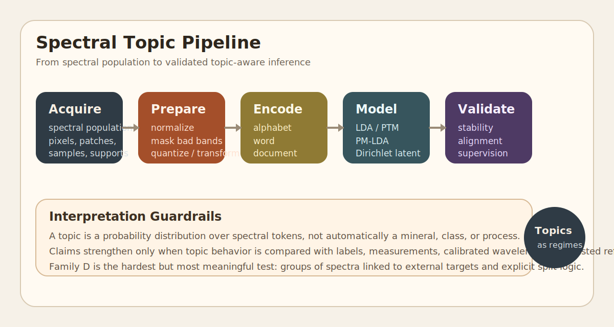
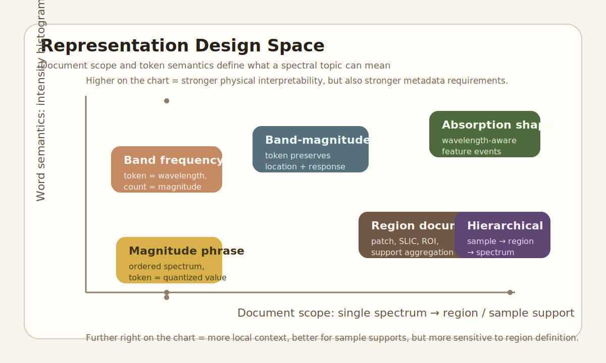

# Theory

## Scientific Thesis

The original thesis behind `CAOS_LDA_HSI` is simple and still strong:

> Spectral variability is not merely nuisance noise. Under appropriate
> document definitions, it can be converted into a corpus and studied
> with probabilistic topic models.

This project therefore departs from the common workflow that collapses a
sample or region to one representative spectrum before modelling.

Instead, it asks whether groups of spectra contain structured variation
that is informative about:

- mineral assemblages
- geometallurgical behavior
- moisture or clay content
- vegetation or wetland state
- urban material mixtures
- sample contamination or mixed support effects

## Canonical LDA Mapping

In standard Latent Dirichlet Allocation:

- each document `d` has a topic mixture `theta_d ~ Dirichlet(alpha)`
- each topic `k` has a word distribution `beta_k ~ Dirichlet(eta)`
- each token position `n` in document `d` draws:
  - `z_dn ~ Categorical(theta_d)`
  - `w_dn ~ Categorical(beta_zdn)`

Equivalent compact equations:

```text
theta_d ~ Dir(alpha)
beta_k  ~ Dir(eta)
z_dn    ~ Cat(theta_d)
w_dn    ~ Cat(beta_z_dn)
```

For spectral PTM/LDA, the missing bridge is not the topic model itself
but the mapping:

```text
x_d(lambda_n) -> q(x_d, lambda_n) -> w_dn
```

where `x_d(lambda_n)` is the measured spectral response and `q` is the
chosen discretization or symbolic encoding rule.

The scientific work is therefore not in LDA alone. It is in how a
spectral process becomes:

- an alphabet
- words
- documents
- a corpus

## Why The Mapping Is Nontrivial

Natural language starts from a finite symbolic alphabet. Spectral data
does not. Hyperspectral and multispectral measurements are:

- continuous or high-bit-depth
- ordered by wavelength
- often spatially structured
- subject to physics, calibration, illumination, and mixing effects

So the central translation problem is:

1. how to construct a finite vocabulary without destroying the signal
2. how to define documents so that the model sees meaningful context
3. how to interpret a topic without pretending it is already a mineral

## Representation Families

### A. Magnitude Alphabet, Spectrum Phrase

Each band emits one quantized intensity token:

- alphabet: `q00 ... qN`
- word: one quantized magnitude
- document: one ordered spectrum or one ordered spectral phrase

This is the most text-like analogy. It preserves order in the original
sequence but weakens direct wavelength identity unless band position is
also retained.

### B. Band Alphabet, Magnitude Frequency

Each band or wavelength is the word, and intensity becomes count or
weight:

- alphabet: `b001`, `b002`, ... or calibrated wavelengths
- word: one band
- count: transformed intensity
- document: one spectrum or one aggregated support

This is physically interpretable because dominant topic words are actual
bands or wavelength bins.

### C. Band-Intensity Events

Each word binds location and magnitude:

- `b042_q03`
- `2200nm_q07`
- `swir_abs_high`

This is usually the strongest classical LDA representation because it
preserves more of the original signal structure, but it also increases
vocabulary sparsity.

### D. Region Documents

A document does not have to be one spectrum. It can be:

- a patch
- a superpixel
- a class region
- a sample support
- a set of spectra attached to one measurement

This is essential for the postdoctoral idea because the measured object
is often not a single pixel, but a distribution of local spectra.

### E. Hierarchical Sample Documents

For measured laboratory or geometallurgical data, a hierarchy is often
more natural:

- sample
- cube
- region
- spectrum

This matters because the downstream target usually belongs to the sample
or measurement support, not to each raw pixel.

## Continuous Data And Infinite Vocabularies

The original project question about infinite alphabets is valid.

There are two important precedents:

1. **Online LDA with Infinite Vocabulary**
   keeps the observation symbolic but allows the vocabulary to expand
   dynamically rather than fixing it in advance.

2. **Continuous or Gaussian topic models**
   replace the multinomial observation model with continuous topic
   distributions, avoiding hard vector quantization.

3. **Mixed discrete/continuous topic models**
   extend topic models so that not every observable has to be forced
   into a purely discrete bag-of-words representation.

For this repo, the practical conclusion is:

- discretized symbolic corpora remain the right baseline because they are
  interpretable and reversible
- infinite-vocabulary and continuous-topic variants should be documented
  as important future comparison lines
- mixed-observation models are especially relevant when future work
  wants to combine symbolic tokens with continuous spectral-shape
  descriptors

## Hyperspectral-Specific PTM Interpretations

The project should distinguish at least three PTM roles.

### 1. Exploratory Regime Discovery

Topics are latent spectral regimes. They may correspond to:

- frequent band behaviors
- absorption neighborhoods
- mixed material states
- spatially recurring support patterns

They are not semantic truth by themselves.

### 2. Variability-Aware Grouping

The topic mixture of a document can summarize how one spectral object
distributes across multiple latent regimes, rather than forcing a single
class or endmember.

### 3. Topic-Routed Inference

If targets exist, the topic mixture can guide downstream modelling:

- as a low-dimensional feature vector
- as a soft gating variable
- as a cluster-like routing prior for local regressors/classifiers

## Relation To PM-LDA And Unmixing

The literature already contains a close adjacent line:

- PM-LDA for hyperspectral unmixing
- semi-supervised PM-LDA for variability-aware endmember estimation

This is important because it confirms that topic-style latent
proportions are physically meaningful in hyperspectral analysis when:

- variability matters
- spatial support matters
- mixtures dominate pure-pixel assumptions

The key difference is that `CAOS_LDA_HSI` is broader:

- it is not only unmixing
- it also targets measured sample supports and topic-routed inference
- it treats corpus design itself as a first-class research object

## Validation Requirements

No topic surface should be interpreted without these conditions being
explicit:

1. what the words are
2. what the documents are
3. how intensities were normalized or quantized
4. whether wavelength calibration is exact or approximate
5. whether labels were used for training, only for evaluation, or not at
   all
6. what baseline the topic result is being compared against

## Diagrams





## Key References

- Blei, Ng, Jordan. *Latent Dirichlet Allocation*. JMLR, 2003.
- Zhai, Boyd-Graber. *Online Latent Dirichlet Allocation with Infinite
  Vocabulary*. ICML / PMLR, 2013.
- Giesen et al. *Method of Moments for Topic Models with Mixed Discrete
  and Continuous Features*. IJCAI, 2021.
- Zou, Zare. *Hyperspectral Unmixing with Endmember Variability using
  Partial Membership Latent Dirichlet Allocation*. arXiv, 2016.
- Zou, Sun, Zare. *Semi-supervised PM-LDA*. arXiv, 2017.
- Chitnis, Mantripragada, Qureshi. *SpACNN-LDVAE*. arXiv, 2023.
