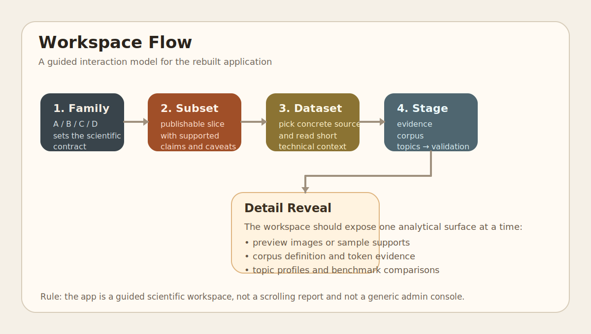

# Workspace Guide

## Goal

The application should not behave like a long scientific blog post or a
generic three-column admin console.

It should guide the user through a real analytical flow:

1. understand the thesis
2. inspect the available dataset family
3. choose a concrete dataset or publishable subset
4. inspect the corpus design
5. inspect topics
6. compare against baselines
7. inspect inference only if valid
8. inspect validation and caveats

## Page Structure

### Landing

Purpose:

- concise statement of the project
- links to core papers, repository, ORCID, LDA/PTM references, and
  dataset sources
- high-level scientific rationale

### Overview

Purpose:

- deep but navigable methodological explanation
- equations
- representation families
- dataset families
- conceptual diagrams

### Workspace

Purpose:

- actual analysis surface
- not every dataset shown at once
- not every metric shown at once
- controlled flow from source selection to evidence and validation

### Usage

Purpose:

- explain how to prepare local environments
- explain how to fetch or build data
- explain the difference between web, pipeline, and local-core commands

### Benchmarks

Purpose:

- summarize what the local-core results actually support
- make clear which claims are still blocked

## Workspace Interaction Design

### Step 1. Select family

The first selection should be conceptual:

- Family A: individual spectra
- Family B: labeled spectral images
- Family C: unlabeled spectral images
- Family D: regions with measurements

### Step 2. Select subset and dataset

The second selection should be concrete:

- which publishable subset
- which local dataset inside that subset

### Step 3. Select workflow stage

The third selection should follow the scientific process:

- evidence
- corpus
- topics
- baselines
- inference
- validation

### Step 4. Reveal detail gradually

The view should expand the chosen item, not dump everything at once.

That means:

- topic tokens appear only after a topic surface is selected
- regression/classification metrics appear only where targets exist
- warning cards remain visible beside any promising result

## Family-Specific Notes

### Family A

Need:

- nearest-reference comparison
- wavelength-aware topic tokens
- strong caveat that reference similarity is not identification

### Family B

Need:

- RGB or false-color scene previews
- class-level mean spectra
- label-topic association views
- label-aware benchmark cards

### Family C

Need:

- exploratory previews
- topic/cluster comparisons
- SLIC or region grouping
- spectral-library neighborhoods
- strong caveat language

### Family D

Need:

- subset-level measurement summaries
- sample/cube/region document logic
- target-aware task summaries
- preprocessing and split-sensitivity evidence

## Diagram

